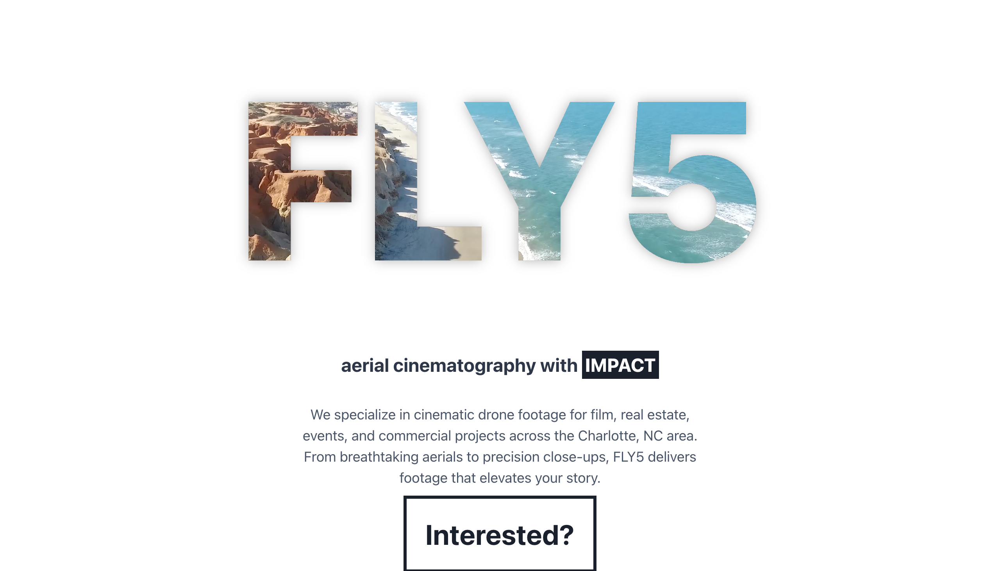
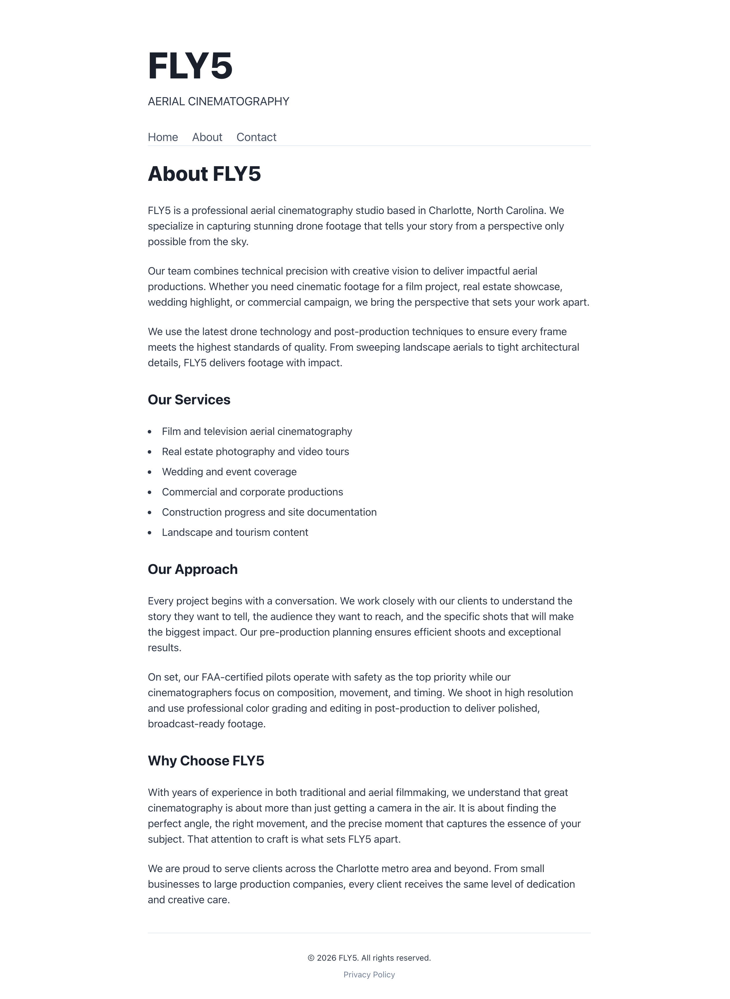
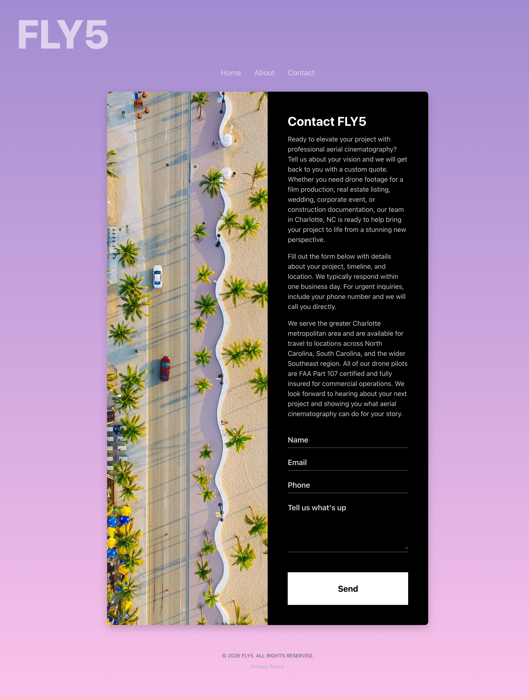

<h1 align="center">FLY5</h1>

<p align="center">
  <strong>Aerial Cinematography with Impact</strong>
</p>

<p align="center">
  <a href="https://fly5.live">🚀 fly5.live</a>
</p>

---

<p align="center">
  
</p>

FPV freestyle and aerial cinematography team. Professional drone video production for events, real estate, action sports, and creative projects.

## Screenshots

<p align="center">
  
  &nbsp;&nbsp;
  
</p>

## Development

```bash
npm install
npm run dev
```

Visit [fly5.live](https://fly5.live) to see it live.

## License

MIT
